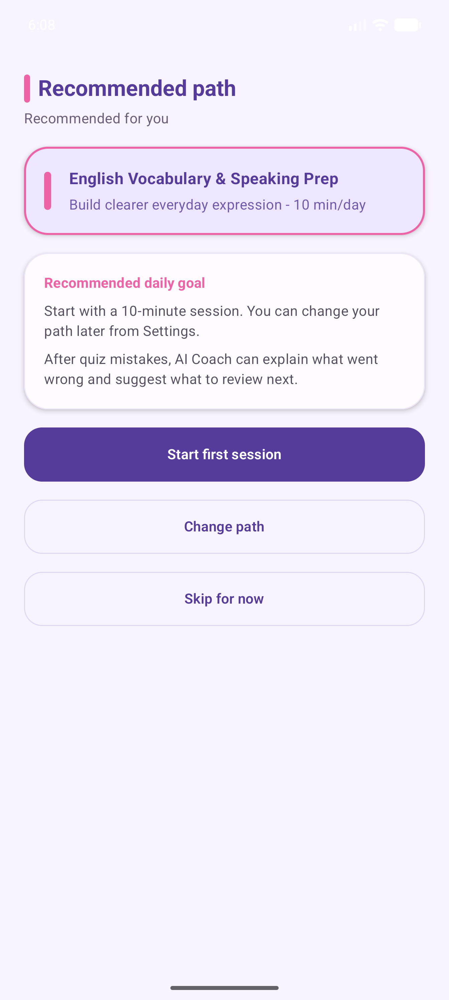
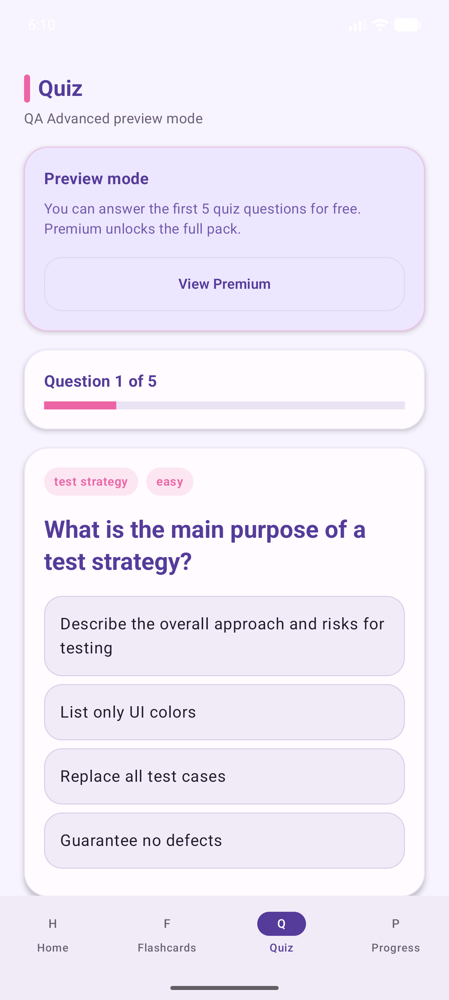
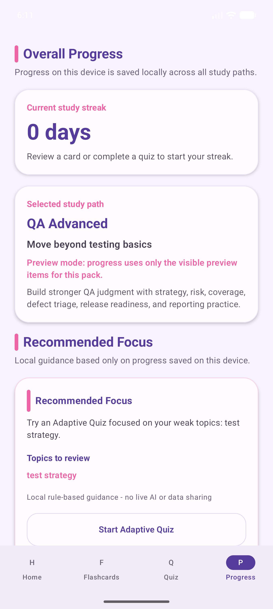

# LearnLift AI

**A privacy-conscious Android study companion for building a short, repeatable learning habit with focused practice paths, flashcards, quizzes, and local progress tracking.**

## Overview

LearnLift AI is an Android MVP for people who want a lightweight way to practise career and language skills without creating an account. It starts with guided onboarding, then gives the learner a small daily study session, flashcards, quizzes, and a local progress view.

The included study paths cover English vocabulary and speaking, job-interview preparation, and IT/QA interview preparation. Additional premium study packs are present in the codebase with preview behaviour; their commercial configuration still requires external RevenueCat and Google Play setup.

There is no verified public store listing or live product URL in this repository, so none is claimed here.

## Screenshots

These are captured app QA artifacts from this repository, not mockups.

<p align="center">
  
  
  
</p>

More evidence images and UI-hierarchy captures are available in [`docs/qa-artifacts`](docs/qa-artifacts). A dedicated `docs/screenshots` portfolio set has not yet been prepared.

## Implemented Features

- Guided onboarding with a goal, recommended study path, and daily-study preference.
- Local study paths backed by versioned JSON content in the app assets.
- Daily study sessions, flashcard review, and quizzes with answer feedback.
- Adaptive quiz selection and topic-performance tracking.
- Local progress, streaks, flashcard-review state, onboarding choices, and reminder preferences persisted with DataStore.
- Optional daily reminders, including restoration after device reboot.
- A rule-based Smart Coach and an optional AI Coach client with a local/unavailable fallback.
- Premium-pack previews, entitlement-state handling, and RevenueCat integration points.
- Privacy-conscious Firebase Analytics events and a considered in-app review prompt policy.

## Technology

- Kotlin, Java 17, Gradle, and Android Gradle Plugin
- Jetpack Compose and Material 3
- Android DataStore for on-device preferences and progress
- Local JSON assets for study content
- Firebase Analytics
- RevenueCat Purchases SDK for entitlement and purchase integration
- Supabase Edge Function source for the optional AI Coach proxy
- JUnit 4 unit tests and a Node-based study-content validator

The current Android module targets Android API 35, has a minimum SDK of 24, and uses the application ID `com.learnliftai.app`.

## Architecture

The app is a single Android module. `MainActivity` hosts the Compose UI, while `ui/` contains screens, navigation, theme, and reusable components. The `domain/` package holds study and recommendation models/rules. The `data/` package separates asset loading, DataStore-backed repositories, billing, and the AI client. Android-specific reminder and review-prompt integrations live in their own packages.

Study content ships as local JSON assets. User state remains on-device unless the learner explicitly invokes an optional AI Coach action; those requests are designed to go through the Supabase Edge Function rather than exposing an AI-provider key in the app.

## Main Product Flow

1. A learner completes onboarding and selects a study path.
2. The app starts a short daily session or the learner opens flashcards or a quiz.
3. Completion and answer outcomes update local progress and topic performance.
4. The learner uses the dashboard and progress screen to choose the next practice step.
5. Optional reminders, premium previews, and AI Coach actions are available where configured.

## Product Status

This is an actively developed Android MVP with a substantial local learning flow implemented. It is appropriate as a portfolio codebase and has historical QA evidence in `docs/`.

It is **not claimed as publicly launched**. Release readiness still depends on external/manual verification: a device smoke test, Google Play purchase and restore testing, Supabase AI-proxy deployment and smoke tests, final Play assets, Data Safety review, and signed AAB upload validation.

## My Role

I owned the project end to end: product scope, learning-flow decisions, Android architecture, Kotlin/Compose implementation, local content integration, billing and AI-proxy integration design, analytics/privacy decisions, QA documentation, and release preparation.

AI-assisted development tools were used transparently as part of the workflow. Product decisions, architecture, implementation review, testing, integration, and release ownership remained mine.

## Run Locally

### Prerequisites

- Android Studio with Android SDK Platform 35 installed
- JDK 17 (the Gradle build is configured for Java 17)
- An Android emulator or USB-debuggable Android device for runtime testing
- Node.js, only to run the content-validation script

### Build and test

```powershell
# From the repository root
.\gradlew.bat assembleDebug
.\gradlew.bat lint
.\gradlew.bat test
node scripts\validate-study-content.mjs
```

Open the project in Android Studio, select the `app` run configuration, then choose an emulator or connected device. The debug APK is created at `app/build/outputs/apk/debug/app-debug.apk` and is intentionally ignored by Git.

### Optional service configuration

The core local study flow does not require credentials. AI Coach and purchase behaviour require external configuration:

- Use [`.env.example`](.env.example) as a placeholder-only reference for Supabase Edge Function environment variables. Keep actual values in untracked local/deployment secret storage.
- Supply RevenueCat public SDK configuration through a Gradle property, environment variable, or untracked `local.properties`; do not commit keys.
- Deploy and configure the Supabase `ai-coach` function before expecting live AI responses. See [`supabase/functions/ai-coach/README.md`](supabase/functions/ai-coach/README.md).

## Verification

The repository includes two JUnit test classes for review-prompt policy and screenshot-demo study-plan behaviour, plus [`scripts/validate-study-content.mjs`](scripts/validate-study-content.mjs) to check local study content. Android Lint is available through Gradle.

Historical QA reports document successful builds and static/content checks, but they are evidence from their recorded dates—not a substitute for a fresh device, purchase, or deployed-service verification. See [`docs/V3_8_FINAL_QA_GATE.md`](docs/V3_8_FINAL_QA_GATE.md) and [`docs/QA_PRODUCTION_READINESS_REPORT.md`](docs/QA_PRODUCTION_READINESS_REPORT.md).

## Known Limitations

- Progress and preferences are local to the device; there is no account or cloud sync.
- Study content is bundled with the app rather than managed remotely.
- Premium access is implemented at the app level but needs RevenueCat and Google Play product configuration plus purchase testing.
- The AI Coach is optional and requires a deployed Supabase Edge Function and provider configuration; unavailable responses fall back locally where supported.
- Automated coverage is limited, and device/emulator UI validation is still a separate release gate.
- No public launch, Play Store listing, or production backend deployment is verified by this repository.

## Privacy and Security

The core experience is designed around local storage. The Android client is configured to avoid shipping AI-provider or Supabase service-role secrets; optional AI requests are routed through the Edge Function. RevenueCat public SDK keys are supplied outside version control, and the repository ignores local configuration, signing material, and Android build outputs.

Before any production release, review the final Google Play Data Safety answers, vendor SDK behaviour, backend rate limiting, and deployed-secret handling.

## License

No license file is currently included. Until a license is added, this repository should be treated as **all rights reserved** rather than as an open-source project.
